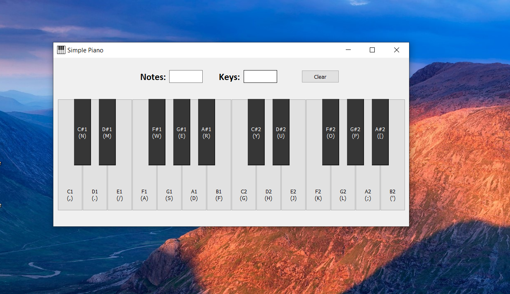

# Simple Piano v1.0
## A piano application developed in Python for entertainment purpose.
 

I just love music a lot. This is what inspired me to create this application, which is a perfect blend of music and technology. It is used to play musical notes, as on a normal and original piano instrument.

 

## Linkedin Post URL - 
https://www.linkedin.com/posts/durgesh-mahajan-99bab0212_softwaredevelopment-uiuxdesign-python3-activity-6860245866490458112-ZQ2O

 

## Stats - 
 

 

## Screenshot

